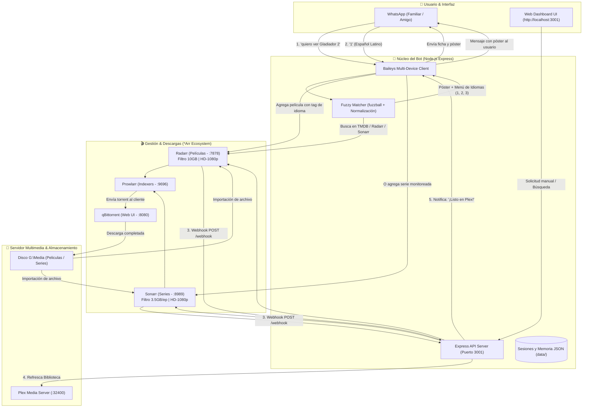

# 🍿 Plex WhatsApp Bot

[](https://nodejs.org/)
[](LICENSE)
[]()
[](https://github.com/WhiskeySockets/Baileys)

Sistema automatizado de gestión multimedia que permite a cualquier familiar o amigo solicitar **películas y series directamente desde WhatsApp**. El bot busca la ficha técnica, envía el póster en alta resolución, ofrece un menú interactivo de idiomas (Latino, Castellano, Subtitulado), aplica límites de tamaño para no saturar el disco (10 GB máx películas / 3.5 GB máx capítulos), coordina las descargas mediante **Radarr**, **Sonarr**, **Prowlarr** y **qBittorrent**, refresca la biblioteca en **Plex Media Server** y envía un mensaje de confirmación automático cuando el contenido está listo para reproducir.

Además, incluye un **Dashboard Web en tiempo real** (`http://localhost:3001`) para monitorear el estado de los servicios, ver las descargas activas de qBittorrent con barras de progreso y probar el motor de búsqueda difusa.

---

## 📐 Arquitectura del Sistema



---

## ✨ Características Principales

- 📱 **Atención Interactiva por WhatsApp (DMs y Grupos)**:
  - Compatible con mensajes directos y grupos de WhatsApp donde participe el bot.
  - Envía la carátula oficial en alta definición con sinopsis y reparto.
  - Menú de selección interactivo por número asociado únicamente al usuario solicitante:
    - `1`: 🇲🇽 Español Latino
    - `2`: 🇪🇸 Español Castellano
    - `3`: 🇬🇧 Idioma Original con Subtítulos
    - `0`: Cancelar
- 🛡️ **Whitelist de Números y Gestión en Web**:
  - Configurable tanto en `.env` (`ALLOWED_NUMBERS`) como **directamente desde el Web Dashboard** (`http://localhost:3001`).
  - Permite añadir o eliminar números y activar/desactivar la restricción al vuelo sin reiniciar.
  - El bot ignora a usuarios no autorizados en **absoluto silencio**, sin entrometerse en conversaciones cotidianas.
- 📺 **Selector de Temporadas para Series**:
  - **En WhatsApp**: Puedes pedir una temporada directamente (ej: *"quiero ver Stranger Things temporada 4"* o *"descárgame Breaking Bad temp 2"*). Si no especificas temporada, el bot te presenta un menú interactivo para elegir si quieres la Temporada 1, la última temporada emitida o la serie completa.
  - **En Web UI**: Al buscar series, dispones de un menú desplegable para elegir la temporada exacta a solicitar.
  - En Sonarr se monitorea y descarga **únicamente** la temporada elegida, ahorrando espacio en disco.
- ❌ **Cancelación de Descargas Activas en Vivo**:
  - Botón `❌ Cancelar` en cada tarjeta de descarga del Web Dashboard para detener y eliminar cualquier torrent y sus archivos de qBittorrent de inmediato.
- 🔄 **Reintento Inteligente de Descargas Fallidas o Colgadas**:
  - Botón `🔄 Reintentar` individual en cada descarga y botón global `🔄 Reintentar Colgadas` en el encabezado.
  - Detecta torrents con estado `stalledDL`, `metaDL`, `error` o sin semillas.
  - Si la descarga proviene de Sonarr o Radarr, elimina el torrent muerto, **lo añade a la lista negra (blocklist)** para no volver a descargarlo y **dispara automáticamente una nueva búsqueda de releases alternativos**.
  - Si es una descarga directa en qBittorrent, aplica recomprobación forzada, re-anuncio a todos los trackers y arranque forzado.
  - Botón `🔄 Reintentar` en el historial de solicitudes para relanzar búsquedas directamente.
- 🗣️ **Lenguaje Natural Inteligente (Anti Falsos Positivos)**:
  - Admite peticiones naturales como *"quiero ver Gladiator 2"*, *"descárgame Inception"*, *"búscame The Batman"*.
  - **Filtro gramatical**: Si la frase inicia con *"quiero ver"*, pero continúa con conjunciones o charlas cotidianas (*"si vamos al cine"*, *"que onda hoy"*, *"cómo estás"*), el bot detecta que es una conversación casual y se queda en silencio.
- 🍿 **Detección Inmediata de Contenido Existente**:
  - Si la película o serie ya está descargada en el disco / Plex, el bot responde de inmediato avisando que ya está disponible para ver, sin gastar ancho de banda ni re-descargar.
  - Si ya está en la cola de descarga, informa su estado actual.
- 🧠 **Motor de Búsqueda Difusa (`fuzzball`)**:
  - Búsqueda tolerante a faltas ortográficas, acentos y variaciones de título (ej: *"Increibles 2"*, *"Gladiador 2"*, *"Intensamente 2"*).
  - Ponderación de similitud léxica combinada con score de popularidad para acertar siempre en el título oficial.
- ⚖️ **Límite Estricto de Tamaño**:
  - **Películas**: Límite máximo de **10 GB** (Custom Format en Radarr con score `-10000` y perfil `HD-1080p`, bloqueando remuxes de 30-50 GB o 4K innecesarios).
  - **Series**: Límite máximo de **3.5 GB por episodio**.
- 🌐 **Web Dashboard Integrado (`http://localhost:3001`)**:
  - **Estado en Vivo**: Monitoreo de conectividad con WhatsApp, Radarr, Sonarr, qBittorrent y Plex.
  - **Descargas en Tiempo Real**: Barras de progreso con velocidad (KB/s, MB/s), tiempo estimado (ETA), peso y estado de qBittorrent.
  - **Historial de Solicitudes**: Lista de pedidos recientes con póster, fecha, usuario solicitante y estado.
  - **Buscador & Probador Difuso**: Búsqueda interactiva con visualización de scores para auditar el matching.
  - **Acciones Rápidas**: Refresco manual de bibliotecas de Plex y visualizador de los últimos logs.
- ⚡ **Ejecución Silenciosa en Segundo Plano**:
  - Arranca sin ventanas de consola invasivas mediante script VBScript (`start-background.vbs`).
  - Compatible con el inicio automático de Windows (`shell:startup`).
  - Scripts de gestión con un solo clic: `status-bot.bat` y `stop-bot.bat`.
- 🔔 **Notificaciones Automáticas End-to-End**:
  - En cuanto la descarga termina y el archivo se importa a `G:\Media\...`, el bot refresca Plex y notifica al usuario en WhatsApp con la confirmación final.

---

## 📁 Estructura del Proyecto

```text
lively-volta/
├── data/                         # Almacenamiento local persistente
│   ├── auth_info_baileys/        # Credenciales de sesión de WhatsApp (QR)
│   ├── requests.json             # Historial de peticiones realizadas
│   ├── user_sessions.json        # Estados de conversación interactiva
│   └── bot.log                   # Registro de actividad en segundo plano
├── docs/
│   └── GUIA_CONFIGURACION.md     # Guía detallada paso a paso de cada servicio
├── public/                       # Frontend del Web Dashboard
│   ├── index.html                # Interfaz de usuario moderna
│   ├── styles.css                # Estilos oscuros (Dark Theme)
│   └── app.js                    # Lógica de actualización asíncrona en vivo
├── setup/                        # Scripts de instalación y configuración
│   ├── install-services.ps1      # Instalador winget de qBittorrent, Radarr, etc.
│   ├── install-background-task.ps1 # Registro de inicio automático con Windows
│   └── uninstall-background-task.ps1 # Desinstalador de la tarea de inicio
├── src/
│   ├── index.js                  # Punto de entrada y orquestador principal
│   ├── config.js                 # Carga de variables de entorno y validaciones
│   ├── db.js                     # Gestor de base de datos JSON atómica
│   ├── tmdb.js                   # Búsqueda difusa multi-fuente (fuzzball)
│   ├── arr-service.js            # Cliente API para Radarr y Sonarr
│   ├── webhook-server.js         # Servidor Express, API REST y webhooks
│   └── whatsapp.js               # Cliente WhatsApp con Baileys
├── test/                         # Scripts de prueba y simulación
│   ├── test-search.js            # Test de búsqueda y scoring
│   └── simulate-webhook.js       # Simulador de webhook de descarga
├── .env                          # Variables de entorno (API keys, puertos, rutas)
├── .env.example                  # Plantilla de configuración de ejemplo
├── package.json                  # Dependencias y scripts de npm
├── start-background.vbs          # Iniciador invisible en segundo plano
├── start-bot.bat                 # Iniciador en ventana de consola (primer escaneo QR)
├── status-bot.bat                # Comprobador de estado y apertura del Dashboard
└── stop-bot.bat                  # Detención segura del proceso de Node.js
```

---

## 🚀 Requisitos Previos

1. **Windows 10 / 11** de 64 bits.
2. **Node.js 18** o superior instalado ([nodejs.org](https://nodejs.org/)).
3. **Plex Media Server** instalado y corriendo en `http://localhost:32400`.
4. **qBittorrent** (con Web UI activada en el puerto `8080`).
5. **Radarr** (puerto `7878`), **Sonarr** (puerto `8989`) y **Prowlarr** (puerto `9696`).

> 💡 *Puedes instalar qBittorrent, Radarr, Sonarr y Prowlarr automáticamente ejecutando `setup/install-services.ps1` en PowerShell como Administrador.*

---

## ⚙️ Configuración Inicial

### 1. Clonar o Descargar el Proyecto
Abre tu terminal en la carpeta del proyecto e instala las dependencias:
```powershell
npm install
```

### 2. Configurar el archivo `.env`
Copia el archivo `.env.example` a `.env` y completa los valores correspondientes:

```env
# Puerto del servidor local para API, Webhooks y Dashboard UI
PORT=3001

# Rutas de almacenamiento en disco para tu contenido multimedia
MOVIES_PATH=C:\Media\Peliculas
SERIES_PATH=C:\Media\Series

# Configuración de Radarr (Películas)
RADARR_URL=http://localhost:7878
RADARR_API_KEY=tu_api_key_de_radarr

# Configuración de Sonarr (Series)
SONARR_URL=http://localhost:8989
SONARR_API_KEY=tu_api_key_de_sonarr

# Configuración de Prowlarr (Búsqueda e Indexers)
PROWLARR_URL=http://localhost:9696
PROWLARR_API_KEY=tu_api_key_de_prowlarr

# Configuración de qBittorrent WebUI
QBITTORRENT_URL=http://127.0.0.1:8080

# Configuración de Plex Media Server
PLEX_URL=http://localhost:32400
PLEX_TOKEN=tu_plex_token_opcional

# (Recomendado) Google Gemini AI para normalización de lenguaje natural
GEMINI_API_KEY=tu_gemini_api_key
GEMINI_MODEL=gemini-3.6-flash

# (Opcional) TMDB API Key - Si se deja vacío usa búsqueda integrada de Radarr/Sonarr
TMDB_API_KEY=

# Palabras clave que activan el bot en WhatsApp
TRIGGER_KEYWORDS=quiero ver,!pedir,!ver,descargar,búscame,buscame

# Whitelist de números autorizados (separados por coma)
# Ejemplo: 56912345678, +54 9 11 1234-5678
# Si se deja vacío, el bot opera en modo abierto (atiende a cualquiera).
ALLOWED_NUMBERS=
```

### 3. Vincular WhatsApp por Primera Vez
Para escanear el código QR con el celular:
1. Ejecuta en tu consola:
   ```powershell
   npm start
   # o ejecuta iniciar-bot.bat
   ```
2. En la terminal aparecerá un código QR.
3. En WhatsApp (desde tu teléfono secundario o tu propio número):
   - Ve a **Ajustes** $\rightarrow$ **Dispositivos vinculados** $\rightarrow$ **Vincular un dispositivo**.
   - Escanea el código QR de la pantalla.
4. Una vez que la consola confirme `🎉 ¡WHATSAPP CONECTADO EXITOSAMENTE!`, ya puedes cerrar la ventana. Las credenciales quedarán guardadas permanentemente en `data/auth_info_baileys/`.

---

## 🔌 Configuración de Servicios Externos

### A. qBittorrent
1. Ve a **Herramientas** $\rightarrow$ **Opciones** $\rightarrow$ **Web UI**.
2. Marca **Interfaz de usuario web (Control remoto)** en el puerto `8080`.
3. Usuario: `admin`, Contraseña: la que definas (por defecto `adminadmin`).
4. En **Conexión**, se recomienda desmarcar **Usar UPnP** si tu router tiene problemas de asignación de puertos en la red local.

### B. Radarr y Sonarr: Webhook hacia el Bot
Para que el bot sepa cuándo finalizó la descarga y avise al familiar:
1. En Radarr (y lo mismo en Sonarr), ve a: **Settings** $\rightarrow$ **Connect** $\rightarrow$ botón `+` $\rightarrow$ **Webhook**.
2. **Name**: `Plex WhatsApp Bot`
3. **Triggers**:
   - ✅ **On Download**
   - ✅ **On Upgrade**
4. **URL**: `http://localhost:3001/webhook`
5. **Method**: `POST`
6. Haz clic en **Test** y luego en **Save**.

### C. Límite de Tamaño a 10 GB en Radarr
Para evitar descargar archivos excesivamente pesados (como remuxes 4K de 20-30 GB):
1. **Perfil de Calidad**: En **Settings** $\rightarrow$ **Profiles**, selecciona `HD-1080p` como perfil predeterminado y desmarca calidades 4K/2160p.
2. **Custom Format**: En **Settings** $\rightarrow$ **Custom Formats**, añade una condición `SizeSpecification` con mínimo `10` GB y máximo `500` GB, nombrada *"Excede 10GB"*.
3. En tu perfil de calidad, asígnale una puntuación de `-10000` a ese formato y coloca `Minimum Custom Format Score: 0`.

---

## 🖥️ Ejecución y Control (Un Solo Script)

### Script Único: `iniciar-bot.bat`
Para iniciar, reiniciar, consultar el estado o detener el bot, **solo necesitas hacer doble clic en `iniciar-bot.bat`**:
- **Si el bot está detenido**: Lo inicia automáticamente en segundo plano (sin ventanas molestas), comprueba la conexión con WhatsApp/Sonarr/Radarr y abre el Dashboard Web (`http://localhost:3001`).
- **Si el bot ya está corriendo**: Despliega un menú interactivo para abrir el panel web, reiniciar el servicio, ver registros en vivo (`logs`) o detenerlo por completo.

```cmd
# Comandos rápidos por terminal (opcional):
iniciar-bot.bat start    # Arranca el servicio en segundo plano
iniciar-bot.bat restart  # Reinicia el servicio
iniciar-bot.bat stop     # Detiene el servicio
```

### Inicio Automático con Windows
Para que el bot arranque automáticamente cada vez que inicies sesión en tu PC sin que tengas que hacer nada:
1. Abre **PowerShell** en esta carpeta y ejecuta:
   ```powershell
   powershell -ExecutionPolicy Bypass -File .\setup\install-background-task.ps1
   ```
2. Esto creará el acceso directo invisible en `shell:startup`. Si deseas desinstalarlo en el futuro, ejecuta `uninstall-background-task.ps1`.

---

## 💬 Uso del Bot por WhatsApp

| Situación | Mensaje del Usuario | Comportamiento / Respuesta del Bot |
| :--- | :--- | :--- |
| **Petición nueva** | `quiero ver Gladiador 2`<br/>o `descárgame Inception`<br/>o `búscame Stranger Things` | Envía la portada oficial en HD, sinopsis, calificación y menú interactivo de idiomas (1, 2, 3, 0). |
| **Elección de idioma** | `1` | *"✅ ¡Excelente! Buscando y agregando en Español Latino 🇲🇽 a la cola de descarga..."* |
| **Descarga terminada** | *(Automático)* | *"🍿 ¡Tu pedido ya está listo en Plex! 🎬 Gladiator II (2024). ¡A disfrutar! 🎉"* |
| **Película ya en Plex** | `quiero ver Los Increíbles 2` | *"🍿 ¡Incredibles 2 (2018) ya se encuentra en tu servidor Plex! Ya está descargada y lista para ver."* *(No re-descarga).* |
| **Película en descarga** | `quiero ver Dune 2` *(si ya está en qBittorrent)* | *"⏳ Dune: Part Two ya fue solicitada y se encuentra actualmente descargándose."* |
| **Charla cotidiana** | *"quiero ver si vamos al cine hoy"*, *"quiero ver qué onda"* | **Silencio absoluto.** El filtro detecta la conjunción coloquial y no interrumpe la conversación. |
| **Contacto no autorizado** | Cualquier mensaje de un número fuera de la whitelist | **Silencio absoluto.** Ignorado sin enviar notificaciones ni alertar de la existencia del bot. |

---

## 🌐 Endpoints de la API REST

El servidor Express en el puerto `3001` expone los siguientes endpoints:

- `GET /health`: Estado general del bot, conexión de WhatsApp y de Radarr/Sonarr.
- `GET /api/status`: Diagnóstico detallado en tiempo real de todos los microservicios (WhatsApp, Radarr, Sonarr, qBittorrent, Plex, rutas, whitelist y estadísticas).
- `GET /api/downloads`: Listado en vivo de torrents activos en qBittorrent con progreso porcentual, tasa de transferencia, semillas y banderas de estado (`is_stalled`, `is_error`).
- `POST /api/downloads/cancel`: Cancelar y eliminar una descarga activa y sus archivos en qBittorrent (`{ hash, deleteFiles }`).
- `POST /api/downloads/retry`: Reintentar una descarga específica. Si proviene de Sonarr/Radarr, elimina el torrent, lo bloquea en lista negra y busca un nuevo release (`{ hash }`).
- `POST /api/downloads/retry-stalled`: Escanear y reintentar en lote todas las descargas colgadas, sin semillas o en error.
- `POST /api/requests/retry`: Reiniciar la búsqueda en Radarr/Sonarr para un pedido del historial (`{ id }`).
- `GET /api/requests`: Historial de pedidos registrados en `data/requests.json`.
- `GET /api/whitelist`: Consulta de la lista completa de números autorizados y estado del modo restringido.
- `POST /api/whitelist/add`: Añadir un número a la whitelist (`{ number, label }`).
- `POST /api/whitelist/remove`: Quitar un número de la whitelist (`{ number }`).
- `POST /api/whitelist/toggle`: Habilitar o deshabilitar la restricción de whitelist (`{ enabled }`).
- `GET /api/search?q=nombre`: Búsqueda interactiva con scoring difuso.
- `GET /api/series/seasons?title=nombre`: Consulta de temporadas disponibles para una serie en Sonarr.
- `POST /api/request-media`: Solicitar una película o serie (con `seasonSelection`) desde la interfaz web.
- `POST /api/plex/refresh`: Forzar el escaneo inmediato de las bibliotecas de Plex.
- `GET /api/logs`: Últimas 50 líneas del archivo de registro `data/bot.log`.
- `POST /webhook`: Receptor del payload de descarga completada emitido por Radarr o Sonarr.

---

## 🔊 Nota Técnica: Configuración de Audio 3.1 / 5.1

Si cuentas con un sistema de parlantes como los **Logitech X-540** configurados en modo **3.1** (altavoces frontales izquierdo, central y derecho + subwoofer, sin los traseros):

1. **Configuración en Windows**:
   - Presiona `Win + R`, escribe `mmsys.cpl` y presiona Enter.
   - Selecciona tu salida de audio $\rightarrow$ clic en **Configurar**.
   - Elige **5.1 Envolvente** y en la pantalla de altavoces opcionales **desmarca los altavoces traseros/envolventes**.
   - De este modo, Windows mezclará automáticamente los efectos traseros en los parlantes frontales, manteniendo el canal central exclusivo para las voces nítidas.
2. **Botón Matrix en el altavoz central**: Mantén el botón *Matrix* **apagado** cuando uses los 3 cables de colores (Verde, Negro, Naranja) a la tarjeta de sonido de la PC.
3. **En reproductores (VLC)**: En **Audio** $\rightarrow$ **Dispositivo de audio**, selecciona `5.1` para que el canal central dedicado maneje todos los diálogos sin pérdida de volumen.

---

## 📄 Licencia

Proyecto distribuido bajo la licencia MIT. Siéntete libre de adaptarlo y modificarlo a tu gusto.
