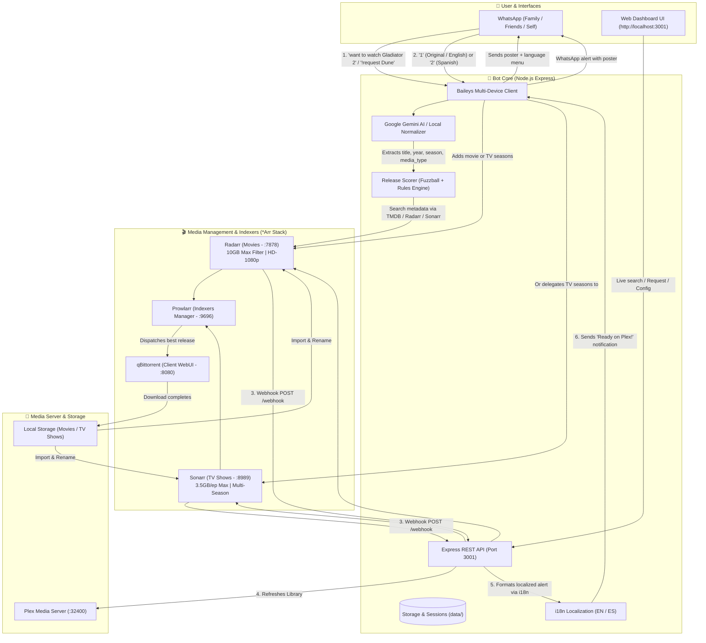

# 🍿 Plex WhatsApp Bot

[](https://nodejs.org/)
[](LICENSE)
[]()
[](https://github.com/WhiskeySockets/Baileys)
[]()

An automated media management bot that enables friends and family to request **movies and TV shows directly via WhatsApp**. The bot resolves media metadata, sends high-resolution cover posters, offers an interactive audio/language menu (English/Original, Latin Spanish, Castilian Spanish), enforces size limits (10 GB max for movies / 3.5 GB max per TV episode), coordinates downloads through **Radarr**, **Sonarr**, **Prowlarr**, and **qBittorrent**, refreshes libraries in **Plex Media Server**, and sends an automated celebration notification when the media is ready to watch.

Includes a **real-time Web Dashboard** (`http://localhost:3001`) to monitor service health, view active qBittorrent downloads with live progress bars, manage the phone whitelist, trigger missing episodes recovery, and test fuzzy matching.

---

## 📐 System Architecture



---

## ✨ Key Features

- 🌐 **Multi-Language Support (i18n)**:
  - Supports **English (`en`)** and **Spanish (`es`)** out of the box.
  - Switchable via `.env` (`BOT_LANGUAGE=en|es`), REST API, or live from the Web Dashboard.
  - Automatically translates interactive WhatsApp menus, prompts, download progress updates, and error alerts.
- 📱 **Interactive WhatsApp Requests**:
  - Request media via private chats or self-notes ("Note to self").
  - Sends official high-definition posters, synopsis, rating, and interactive numeric menus.
  - **Group Chat Protection**: Completely ignores group chats (`@g.us`) to ensure zero accidental interruptions in family, study, or work groups.
- 📺 **Multi-Season & Season Range Selector**:
  - Download single seasons (e.g. *"season 4"* or *"s02"*), ranges (e.g. *"seasons 2-5"* or *"2 to 4"*), or entire series (*"all"*).
  - Web UI dropdown lets you pick individual seasons or ranges.
- 🎯 **Intelligent Release Scorer (Fuzzball)**:
  - Real-time algorithmic evaluation of torrent releases based on string similarity, exact year matches, resolution preference (1080p), source quality (BluRay/Web), seeders count, and strict size caps.
  - Automatically discards undesirable releases like CAM, Telesync, Artbooks, OSTs, or bloated remuxes.
- 🩺 **Missing Episodes Restoration**:
  - One-click rescan and automatic download of unmonitored or missing episodes in Sonarr.
- 🛡️ **Access Control & Whitelist**:
  - Restricts bot interactions to authorized phone numbers configured in `.env` (`ALLOWED_NUMBERS`) or live via Web Dashboard.
  - Unauthorized messages are ignored in **complete silence**.
- 🧹 **Queue Cleanup & Stalled Torrents Recovery**:
  - Remove completed torrents from qBittorrent with one click or via WhatsApp (*"clear completed downloads"*), keeping files safely stored on disk.
  - Smart retry for stalled/dead torrents: automatically blocklists bad releases in Radarr/Sonarr and triggers search for fresh alternatives.

---

## 📋 Prerequisites

| Service | Default Port | Description |
| :--- | :--- | :--- |
| **Node.js** (v18+) | `3001` | Core bot server, API, and Web Dashboard |
| **qBittorrent** | `8080` | Torrent downloader with Web UI enabled |
| **Radarr** | `7878` | Movie manager and quality profiles |
| **Sonarr** | `8989` | TV Series manager and multi-season tracking |
| **Prowlarr** | `9696` | Torrent indexer proxy |
| **Plex Media Server** | `32400` | Local media streaming server |

> 💡 *On Windows, you can install qBittorrent, Radarr, Sonarr, and Prowlarr in one click by running `powershell -ExecutionPolicy Bypass -File .\setup\install-services.ps1` as Administrator.*

---

## ⚙️ Quick Start

### 1. Install Dependencies
Open your terminal in the project directory:
```powershell
npm install
```

### 2. Configure Environment (`.env`)
Copy `.env.example` to `.env` and fill in your details:
```powershell
cp .env.example .env
```

```env
# Local server port for API and Web Dashboard
PORT=3001

# Bot language ('en' for English, 'es' for Spanish)
BOT_LANGUAGE=en

# Media storage paths on disk
MOVIES_PATH=C:\Media\Movies
SERIES_PATH=C:\Media\TV

# Radarr (Movies)
RADARR_URL=http://localhost:7878
RADARR_API_KEY=your_radarr_api_key

# Sonarr (TV Shows)
SONARR_URL=http://localhost:8989
SONARR_API_KEY=your_sonarr_api_key

# Prowlarr (Indexers)
PROWLARR_URL=http://localhost:9696
PROWLARR_API_KEY=your_prowlarr_api_key

# qBittorrent WebUI
QBITTORRENT_URL=http://127.0.0.1:8080

# Plex Media Server
PLEX_URL=http://localhost:32400
PLEX_TOKEN=your_plex_token_optional

# (Recommended) Google Gemini AI API key for natural language request parsing
GEMINI_API_KEY=your_gemini_api_key
GEMINI_MODEL=gemini-3.6-flash

# (Optional) TMDB API Key - Defaults to Sonarr/Radarr search if omitted
TMDB_API_KEY=

# Trigger keywords for activating the bot via WhatsApp
TRIGGER_KEYWORDS=want to watch,download,!request,!get,quiero ver,!pedir,!ver,descargar

# Authorized phone numbers whitelist (comma-separated, international format without symbols)
# Example: 15551234567,447911123456
# Leave empty for open mode
ALLOWED_NUMBERS=
```

### 3. Pair WhatsApp
To link your WhatsApp account via QR code:
1. Run in your terminal:
   ```powershell
   npm start
   ```
2. Scan the displayed QR code on your phone (**WhatsApp** $\rightarrow$ **Linked Devices** $\rightarrow$ **Link a Device**).
3. Once connected, your credentials are saved in `data/auth_info_baileys/`. You can close the terminal.

---

## 🖥️ Management & Control (One Script)

### Single Controller: `iniciar-bot.bat`
Double-click `iniciar-bot.bat` to manage the service:
- **If stopped**: Starts the background process invisibly, tests service health, and launches the Web UI Dashboard (`http://localhost:3001`).
- **If running**: Displays an interactive menu to view live logs, restart, open the dashboard, or stop the service.

```cmd
# Command line options:
iniciar-bot.bat start    # Start background process
iniciar-bot.bat restart  # Restart process
iniciar-bot.bat stop     # Stop process
```

### Windows Auto-Start on Boot (Optional)
To run the bot silently in the background whenever Windows starts:
```powershell
powershell -ExecutionPolicy Bypass -File .\setup\install-background-task.ps1
```
*(To uninstall later, run `setup/uninstall-background-task.ps1`).*

---

## 💬 WhatsApp Usage Examples

| Situation | User Message (English / Spanish) | Bot Response / Action |
| :--- | :--- | :--- |
| **New Movie** | `I want to watch Gladiator 2`<br/>`quiero ver Gladiador 2` | Sends HD poster, synopsis, score, and audio options (`1`, `2`, `3`, `0`). |
| **Audio Selection** | `1` | *"✅ Great! Adding in Original Audio 🇺🇸 to download queue..."* |
| **Single Season** | `Stranger Things season 4`<br/>`Stranger Things temp 4` | Downloads Season 4 only, avoiding full series downloads. |
| **Season Range** | `download Loki seasons 1 to 2`<br/>`bájate Loki temporadas 1-2` | Automatically parses `1-2` and monitors requested seasons in Sonarr. |
| **Download Ready** | *(Automatic alert)* | *"🍿 Your request is ready on Plex! 🎬 Gladiator II (2024). Enjoy watching! 🎉"* |
| **Already in Plex** | `I want to watch Incredibles 2` | *"🍿 Incredibles 2 (2018) is already available on your Plex server! Ready to watch."* |
| **Already in Queue** | `want to watch Dune 2` *(if downloading)* | *"⏳ Dune: Part Two has already been requested and is currently downloading."* |
| **Queue Cleanup** | `clear completed downloads`<br/>`limpiar completadas` | Cleans finished items from qBittorrent queue while preserving video files on disk. |
| **Missing Episodes** | `restore missing episodes of Top Gear`<br/>`faltan episodios de Top Gear` | Triggers disk rescan and searches for missing episodes in Sonarr. |
| **Casual Chat** | *"see you tomorrow"*, *"joya"*, *"okay"* | **Complete silence.** Anti-false-positive filters prevent accidental responses. |
| **Group Chats** | Any message in WhatsApp groups | **Complete silence.** Group chats are strictly blocked for user privacy. |

---

## 🌐 REST API Endpoints

The Express server on port `3001` provides:

- `GET /health`: Overall health, WhatsApp connection, and Radarr/Sonarr status.
- `GET /api/status`: Complete diagnostics for all services, download metrics, paths, and whitelist.
- `GET /api/config/language`: Returns current active bot language (`en` or `es`) and supported languages.
- `POST /api/config/language`: Live update of bot language (`{ "language": "en" | "es" }`).
- `GET /api/downloads`: Live list of qBittorrent torrents with progress, speed, seeders, and status flags.
- `POST /api/downloads/cancel`: Cancel and remove a torrent and its files (`{ "hash": "...", "deleteFiles": true }`).
- `POST /api/downloads/retry`: Smart retry for an individual download (blocklists dead torrent and searches new release).
- `POST /api/downloads/retry-stalled`: Batch retry for all stalled, slow, or seedless torrents.
- `POST /api/requests/retry`: Restart search in Radarr/Sonarr for a previous request.
- `GET /api/requests`: Complete request history log.
- `GET /api/whitelist`: Whitelist status and authorized numbers list.
- `POST /api/whitelist/add`: Add a contact (`{ "number": "...", "label": "..." }`).
- `POST /api/whitelist/remove`: Remove an authorized contact (`{ "number": "..." }`).
- `POST /api/whitelist/toggle`: Enable/disable whitelist enforcement (`{ "enabled": true }`).
- `GET /api/search?q=query`: Interactive search with fuzzy scoring.
- `GET /api/series/seasons?title=name`: Retrieve available seasons for a show from Sonarr.
- `POST /api/request-media`: Request movie or series (with `seasonSelection`) directly via Web UI.
- `POST /api/plex/refresh`: Force Plex library scan immediately.
- `GET /api/logs`: Last 50 log lines from `data/bot.log`.
- `POST /webhook`: Webhook receiver for Radarr and Sonarr download events.

---

## 🔊 Technical Note: 3.1 / 5.1 Audio Configuration

If using a multi-speaker system (e.g. **Logitech X-540**) configured in **3.1 mode** (Front Left, Center, Front Right + Subwoofer, without rear satellites):

1. **Windows Sound Settings**:
   - Press `Win + R`, type `mmsys.cpl`, and hit Enter.
   - Select your output device $\rightarrow$ **Configure**.
   - Choose **5.1 Surround**, and on the optional speakers step, **uncheck rear/surround speakers**.
   - Windows will automatically downmix rear audio channels into front speakers while keeping the center channel dedicated to crisp voice dialogue.
2. **Matrix Mode**: Keep the *Matrix* button **off** on the speaker console when using 3 direct color-coded 3.5mm jacks (Green, Black, Orange) to your sound card.
3. **Media Players (VLC)**: In **Audio** $\rightarrow$ **Audio Device**, select `5.1` to route dialogue directly to the center speaker.

---

## 📄 License

This project is open-source under the [MIT License](LICENSE).
